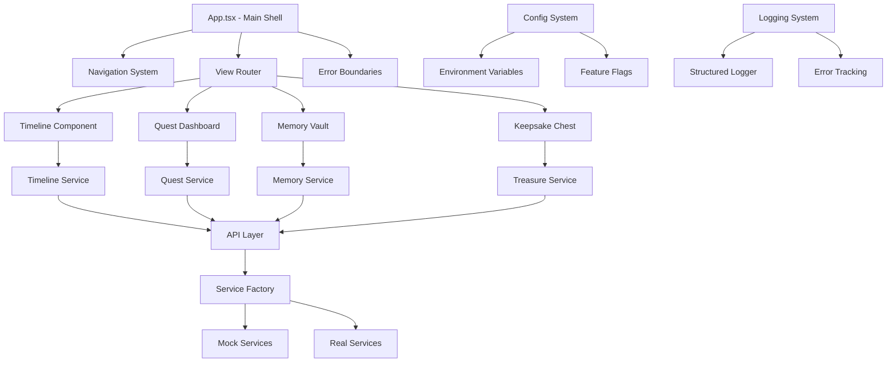

# Design Document

## Overview

> 🚫 This is a greenfield project. No code currently exists. All file structures, component names, and APIs mentioned are part of this design proposal, not based on an existing implementation.

The Love Quest will be built from scratch as a React-based web application using Vite and TypeScript, designed as an emotionally-rich, whimsical experience for Kat. The application will follow a modular architecture with strict technical principles while maintaining the magical, fairytale-like aesthetic that reflects Kat's preferences for pastels, gentle animations, and romantic storytelling.

This design defines all core components — such as Timeline, QuestDashboard, MemoryVault, and KeepsakeChest — from the ground up based on the intended emotional and functional goals outlined in the comprehensive technical specifications.

## Architecture

### High-Level Architecture



### Technical Stack Confirmation

- **Framework**: React 18+ with Vite and TypeScript
- **Styling**: TailwindCSS with custom design tokens
- **Animations**: Framer Motion + Lottie for complex animations
- **Icons**: Lucide React with custom SVG fallbacks
- **Forms**: React Hook Form for quest interactions
- **State Management**: Zustand for global state, React Context for component-level state
- **Data Layer**: Supabase integration with mock layer for development
- **Deployment**: Vercel with preview branches

### File Structure Implementation

```
src/
├── components/
│   ├── Timeline/
│   │   ├── Timeline.tsx
│   │   ├── TimelineEvent.tsx
│   │   ├── TimelineVine.tsx
│   │   └── index.ts
│   ├── Quests/
│   │   ├── QuestDashboard.tsx
│   │   ├── QuestCard.tsx
│   │   ├── QuestModal.tsx
│   │   └── index.ts
│   ├── MemoryVault/
│   │   ├── MemoryVault.tsx
│   │   ├── MemoryCard.tsx
│   │   ├── MemoryModal.tsx
│   │   └── index.ts
│   ├── KeepsakeChest/
│   │   ├── KeepsakeChest.tsx
│   │   ├── CouponCard.tsx
│   │   ├── RewardModal.tsx
│   │   └── index.ts
│   └── Shared/
│       ├── ErrorBoundary.tsx
│       ├── LoadingSpinner.tsx
│       ├── AnimatedBackground.tsx
│       └── ui/ (planned shared UI components such as buttons, modals, icons)
├── mocks/
│   ├── timeline.mock.ts
│   ├── quests.mock.ts
│   ├── memories.mock.ts
│   └── treasures.mock.ts
├── services/
│   ├── ServiceFactory.ts
│   ├── TimelineService.ts
│   ├── QuestService.ts
│   ├── MemoryService.ts
│   └── TreasureService.ts
├── hooks/
│   ├── useTimeline.ts
│   ├── useQuests.ts
│   ├── useMemories.ts
│   └── useTreasures.ts
├── utils/
│   ├── logger.ts
│   ├── api.ts
│   └── animations.ts
├── config.ts
├── App.tsx
└── main.tsx
```

## Components and Interfaces

### Core Data Models

```typescript
// Timeline Models
interface TimelineEvent {
  id: string;
  title: string;
  date: string;
  description: string;
  type: 'memory' | 'quest' | 'milestone';
  completed?: boolean;
  images?: string[];
  location?: string;
  emotionalTags?: string[];
}

// Quest Models
interface Quest {
  id: string;
  title: string;
  description: string;
  date: string;
  difficulty: 'easy' | 'medium' | 'hard';
  category: 'romantic' | 'adventure' | 'creative' | 'cozy';
  points: number;
  unlocked: boolean;
  completed: boolean;
  icon: React.ReactNode;
  reward?: Treasure;
}

// Memory Models
interface Memory {
  id: string;
  title: string;
  date: string;
  location?: string;
  description: string;
  category: 'date' | 'milestone' | 'everyday' | 'adventure';
  images: string[];
  audioClips?: string[];
  tags: string[];
  heartCount: number;
}

// Treasure Models
interface Treasure {
  id: string;
  title: string;
  description: string;
  type: 'coupon' | 'achievement' | 'memory_unlock';
  unlocked: boolean;
  used?: boolean;
  expiryDate?: string;
  value: string;
}
```

### Service Layer Architecture

```typescript
// Service Factory Pattern
class ServiceFactory {
  private static instance: ServiceFactory;
  private useMockData: boolean;

  constructor() {
    this.useMockData = process.env.VITE_USE_MOCK_DATA === 'true';
  }

  static getInstance(): ServiceFactory {
    if (!ServiceFactory.instance) {
      ServiceFactory.instance = new ServiceFactory();
    }
    return ServiceFactory.instance;
  }

  getTimelineService(): ITimelineService {
    return this.useMockData 
      ? new MockTimelineService() 
      : new SupabaseTimelineService();
  }

  // Similar pattern for other services...
}

// Service Interfaces
interface ITimelineService {
  getEvents(): Promise<TimelineEvent[]>;
  addEvent(event: Omit<TimelineEvent, 'id'>): Promise<TimelineEvent>;
  updateEvent(id: string, updates: Partial<TimelineEvent>): Promise<TimelineEvent>;
}
```

### Configuration System

```typescript
// config.ts
interface Config {
  supabase: {
    url: string;
    anonKey: string;
  };
  features: {
    enableMockData: boolean;
    enableAudioClips: boolean;
    enablePushNotifications: boolean;
  };
  ui: {
    animationDuration: number;
    maxImageSize: number;
  };
}

const config: Config = {
  supabase: {
    url: process.env.VITE_SUPABASE_URL || (() => {
      throw new Error('VITE_SUPABASE_URL is required');
    })(),
    anonKey: process.env.VITE_SUPABASE_ANON_KEY || (() => {
      throw new Error('VITE_SUPABASE_ANON_KEY is required');
    })(),
  },
  features: {
    enableMockData: process.env.VITE_USE_MOCK_DATA === 'true',
    enableAudioClips: process.env.VITE_ENABLE_AUDIO === 'true',
    enablePushNotifications: process.env.VITE_ENABLE_NOTIFICATIONS === 'true',
  },
  ui: {
    animationDuration: parseInt(process.env.VITE_ANIMATION_DURATION || '300'),
    maxImageSize: parseInt(process.env.VITE_MAX_IMAGE_SIZE || '5242880'), // 5MB
  },
};

export default config;
```

## Data Models

### Design Token System

```typescript
// Design tokens following Kat's aesthetic preferences
const designTokens = {
  colors: {
    blush: '#F8D8E7',
    peach: '#FFE5D4', 
    mint: '#D4F0E7',
    lavender: '#E7D4F0',
    charcoal: '#2E2E2E',
    ivory: '#FFFDF8',
  },
  fonts: {
    header: ['Poppins', 'Quicksand', 'sans-serif'],
    body: ['Inter', 'sans-serif'],
    script: ['Dancing Script', 'Allura', 'cursive'],
  },
  spacing: {
    borderRadius: '12px',
    shadowSoft: '0 4px 20px rgba(0, 0, 0, 0.08)',
    shadowMedium: '0 8px 30px rgba(0, 0, 0, 0.12)',
  },
  animations: {
    gentle: 'cubic-bezier(0.4, 0, 0.2, 1)',
    bounce: 'cubic-bezier(0.68, -0.55, 0.265, 1.55)',
    duration: {
      fast: '200ms',
      normal: '300ms',
      slow: '500ms',
    },
  },
};
```

### State Management Schema

```typescript
// Zustand store for global state
interface AppState {
  // User preferences
  preferences: {
    animationsEnabled: boolean;
    soundEnabled: boolean;
    theme: 'light' | 'dark';
  };
  
  // Current session
  session: {
    currentView: ActiveView;
    lastVisit: string;
    dailyQuestCompleted: boolean;
  };
  
  // Cached data
  cache: {
    timeline: TimelineEvent[];
    quests: Quest[];
    memories: Memory[];
    treasures: Treasure[];
  };
  
  // Actions
  setCurrentView: (view: ActiveView) => void;
  updatePreferences: (prefs: Partial<AppState['preferences']>) => void;
  markQuestCompleted: (questId: string) => void;
  addMemory: (memory: Memory) => void;
}
```

## Error Handling

### Error Boundary Strategy

```typescript
// Three-tier error boundary system
// 1. App-level boundary - catches critical errors
class AppErrorBoundary extends React.Component<Props, State> {
  static getDerivedStateFromError(error: Error): State {
    logger.error('App-level error caught', { error: error.message, stack: error.stack });
    return { hasError: true, error };
  }

  render() {
    if (this.state.hasError) {
      return (
        <div className="min-h-screen flex items-center justify-center bg-gradient-to-br from-blush to-peach">
          <div className="text-center p-8 bg-white rounded-2xl shadow-soft">
            <h1 className="font-script text-2xl mb-4 text-charcoal">
              Oops! Something magical went wrong ✨
            </h1>
            <p className="font-body mb-6 text-charcoal opacity-80">
              Don't worry, our love story continues! Let's try again.
            </p>
            <Button onClick={() => window.location.reload()}>
              Start Fresh 💕
            </Button>
          </div>
        </div>
      );
    }
    return this.props.children;
  }
}

// 2. Page-level boundaries - isolate view failures
// 3. Component-level boundaries - prevent component cascade failures
```

### API Error Handling

```typescript
// Resilient API client with retry logic
class ApiClient {
  private retryConfig = {
    maxRetries: 3,
    baseDelay: 1000,
    maxDelay: 10000,
  };

  async request<T>(config: RequestConfig): Promise<T> {
    let lastError: Error;
    
    for (let attempt = 0; attempt <= this.retryConfig.maxRetries; attempt++) {
      try {
        const response = await this.makeRequest(config);
        return response.data;
      } catch (error) {
        lastError = error as Error;
        
        if (!this.shouldRetry(error, attempt)) {
          break;
        }
        
        const delay = Math.min(
          this.retryConfig.baseDelay * Math.pow(2, attempt),
          this.retryConfig.maxDelay
        );
        
        await this.sleep(delay);
      }
    }
    
    logger.error('API request failed after retries', {
      url: config.url,
      method: config.method,
      error: lastError.message,
    });
    
    throw lastError;
  }
}
```

## Testing Strategy

### Testing Pyramid

1. **Unit Tests (70%)**
   - Component logic testing with React Testing Library
   - Service layer testing with Jest
   - Utility function testing
   - Mock data validation

2. **Integration Tests (20%)**
   - Component interaction testing
   - API integration testing
   - State management testing
   - Error boundary testing

3. **End-to-End Tests (10%)**
   - Critical user journey testing with Playwright
   - Cross-browser compatibility
   - Performance testing
   - Accessibility testing

### Test Structure

```typescript
// Component testing example
describe('QuestDashboard', () => {
  beforeEach(() => {
    // Setup mock services
    jest.mocked(ServiceFactory.getInstance().getQuestService())
      .mockImplementation(() => new MockQuestService());
  });

  it('should display daily quest with gentle animation', async () => {
    render(<QuestDashboard />);
    
    await waitFor(() => {
      expect(screen.getByText(/Morning Coffee Ritual/)).toBeInTheDocument();
    });
    
    // Test animation presence
    const questCard = screen.getByTestId('quest-card-1');
    expect(questCard).toHaveClass('animate-fadeIn');
  });

  it('should handle quest completion with celebration animation', async () => {
    const user = userEvent.setup();
    render(<QuestDashboard />);
    
    const completeButton = screen.getByRole('button', { name: /Complete Quest/ });
    await user.click(completeButton);
    
    await waitFor(() => {
      expect(screen.getByTestId('celebration-animation')).toBeInTheDocument();
    });
  });
});
```

### Performance Testing

```typescript
// Performance monitoring
const performanceMetrics = {
  // Core Web Vitals
  LCP: 2.5, // Largest Contentful Paint < 2.5s
  FID: 100, // First Input Delay < 100ms
  CLS: 0.1, // Cumulative Layout Shift < 0.1
  
  // Custom metrics
  timeToInteractive: 3000, // < 3s
  animationFrameRate: 60, // 60fps for smooth animations
  memoryUsage: 50 * 1024 * 1024, // < 50MB
};
```

### Accessibility Testing

- WCAG 2.1 AA compliance
- Screen reader compatibility
- Keyboard navigation support
- Color contrast validation (minimum 4.5:1 ratio)
- Focus management for animations
- Alternative text for all images and icons

### Quality Assurance Checklist

- [ ] All animations run at 60fps
- [ ] No horizontal scroll on mobile devices
- [ ] Graceful degradation when JavaScript is disabled
- [ ] All images have proper alt text
- [ ] Color contrast meets WCAG standards
- [ ] Keyboard navigation works throughout
- [ ] Error states are user-friendly and emotionally appropriate
- [ ] Loading states use whimsical animations
- [ ] All user interactions provide gentle feedback
- [ ] The app makes Kat smile on first load (subjective but critical!)

This design ensures the Love Quest maintains its emotional magic while following enterprise-grade technical principles, creating a robust foundation for daily delight and long-term maintainability.